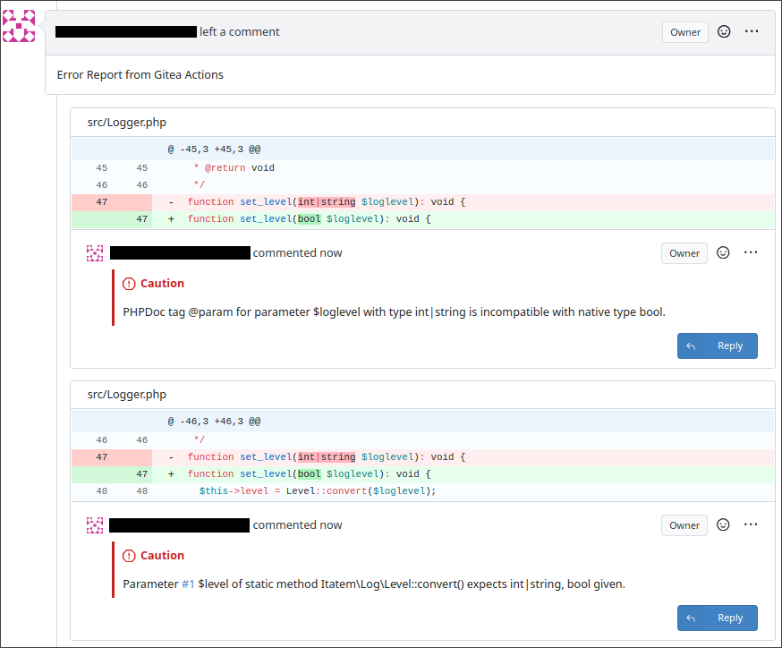

Gitea PRBot
------------

#### Description

> [!WARNING]
> This Action is designed specifically with Gitea in mind
> and serves no purpose for Github Actions

A Simple Gitea Action designed to generate Automatic PR
Reviews via Github-Style
[Error Annotations](https://docs.github.com/en/actions/writing-workflows/choosing-what-your-workflow-does/workflow-commands-for-github-actions#example-creating-an-annotation-for-an-error)
in Automated Gitea Actions.

Since Gitea currently
[does not support "Error Annotations"](https://docs.gitea.com/usage/actions/comparison#create-an-error-annotation)
this fills in the gaps by anayzing the stdout of other action stages
and then can commit the messages to a single review using a designated
service account after the action completes.

#### Usage

```yaml
name: Pull-Request Vibe Check
on:
  pull_request:
    types: [ opened, synchronize, reopened ]

jobs:
  ci-test:
    runs-on: ubuntu-latest
    steps:
      - name: Setup PRBot
        uses: imgurbot12/prbot@v1
        with:
          username:  ${{ secrets.prbot_username }}
          api_token: ${{ secrets.prbot_token }}
      - name: Do Something With Errors
        run: |
          echo "::error file=app.js,line=1::Missing semicolon" | prbot
          echo "::warning file=app.js,line=1,col=5,endColumn=7::Missing semicolon" | prbot
      - name: Post PR Feedback
        if: always()
        run: prbot commit
```

#### Inputs

+ `username`  - username of service account used to post PR
+ `api_token` - gitea api-token for service account to authenticate with

#### Example


